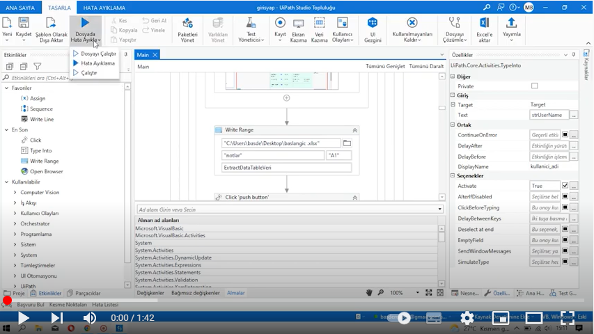

# RPA (Robotik Süreç Otomasyon) Projesi 

## RPA NEDİR ? 

Robotik Süreç Otomasyonu, İngilizcedeki yazılışı ile Robotic Process Automation (RPA), bugün herhangi birisinin bilgisayar yazılımını yapılandırmasına izin veren veya bir iş sürecini yürütmek için dijital sistemler içinde etkileşime giren, bir insanın eylemlerini taklit eden ve entegre eden bir “robot” teknolojidir.

## UiPath Nedir ?

UiPath, herhangi bir web formunda ve masaüstü uygulamasında kesintisiz veri girişi otomasyonu sağlamaya adanmış, Robotik Süreç Otomasyonu (RPA) için platform geliştiren üst düzey küresel bir yazılım şirketidir (RPA veya RPAAI).

## Örnek UiPath Senaryosu 

İçe aktarılan veriler, kitaplar ve yazarlar hakkında bilgiler içerir.  

sistemde sıradaki isim adına bir kayıt yoksa yeni satıcı, kalem kategorisi ve kalem oluşturur. Yazar için bir satıcı, tür için - bir ürün kategorisi, kitap için - bir ürün yaratır.

## Proje Amacı  

Bilecik şeyh edebali üniversitesi öğrenci bilgilendirme sisteminde güz dönemi not verileri ile excelde notlara dair grafik oluşturmak

## Robotik Süreç Otomasyon Adımları 

**Adım 1 :**  Başla  
**Adım 2 :**  Microsoft Edge Tarayıcısını aç    
**Adım 3 :**  **https://obs.bilecik.edu.tr/login.aspx?ReturnUrl=/default.aspx** adresine git   
**Adım 4 :**  Kullanıcı adı ve şifre alanlarını doldur sisteme giriş yap   
**Adım 5 :**  Bilgilendirme Pencerelerini kapat   
**Adım 6 :**  Güz dönemi not bilgilerini seç   
**Adım 7 :**  Not verilerini kopyala   
**Adım 8 :**  Belirlenen konumdaki excel dosyasında **"notlar"** sayfasına not verilerini ekle  
**Adım 9 :**  Grafik için gerekli olan alanları sayısal veri tipine dönüştür   
**Adım 10 :** Alanları seçerek excel sisteminde grafik oluştur    
**Adım 11:**  Grafik görselini ve açıklamaları düzenle   
**Adım 12 :** İşlemler sonunda özet yaz   
**Adım 13 :** çıkış yap 

## Projenin çalışır durumdaki hali  

